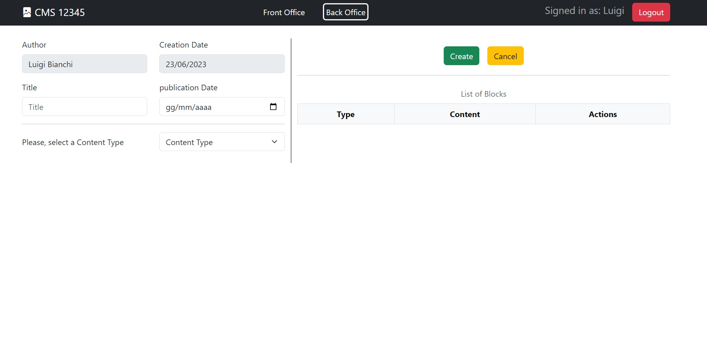
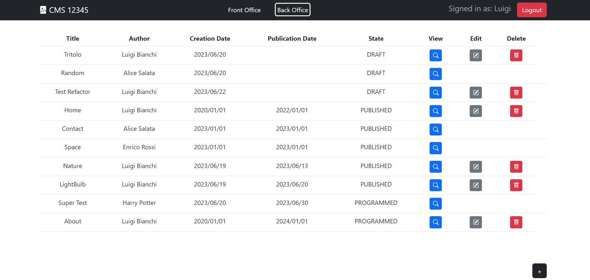

[](https://classroom.github.com/a/suhcjUE-)
# Exam #12345: "Exam Title"
## Student: s305485 PANE RAFFAELE 

## React Client Application Routes

- Route `/login`: login form
- Route `/`: front office, it shows the list of the pubblicated Pages and a modal (for each of them) containing a view of their blocks/properties
- Route `/backoffice`: back office, it shows a list of Pages with several action buttons related to the user "role" (add, edit, view, delete a page)
- Route `/backoffice/add`: it contains a form to create a new Page
- Route `/backoffice/edit/:pageId`: it contains a form to edit an existing Page

## API Server

- GET `/api/pages`
  get all the pages (both pubblicated and not pubblicated) with their blocks sorted
  - request parameters/body: none
  - response body content: array of Page objects, including their blocks
  ```
  [
    {
        "id": 15,
        "title": "Tritolo",
        "authorId": 2,
        "author": "Luigi Bianchi",
        "creationDate": "2023-06-19T22:00:00.000Z",
        "publicationDate": null,
        "blocks": [
            {
                "id": 21,
                "order": 0,
                "type": 1,
                "content": "h1"
            },
            {
                "id": 22,
                "order": 1,
                "type": 2,
                "content": "par"
            }
        ]
    },
    {
      ...
    }
  ]

- POST `/api/pages`
  create a new Page (with its blocks)
  - requires authentication
  - request body content: a JSON object representing a new Page (with its blocks) to be added
  ```
  {
    "title":"Test ",
    "authorId":2,                 // this property is used ONLY in case the request is made by an administrator
    "creationDate":"2023-06-23",
    "publicationDate":null,
    "blocks":[
      {"type":1,"order":0,"content":"My Header"},
      {"type":2,"order":1,"content":"My Paragraph"}
    ]
  }

  - response body content: pageId of the new Page

- POST `/api/pages/:id`
  update an existing Page (with its blocks)
  - requires authentication
  - request parameters: pageId
  - request body content: a JSON object representing the Page (with its blocks) to be updated
  ```
  {
    "id":21,
    "title":"Test ",
    "authorId":2,                     // this property is used ONLY in case the request is made by an administrator
    "creationDate":"2023-06-23",
    "publicationDate":null,
    "blocks":[
      {"id":42,"type":1,"order":0,"content":"My Header","operation":"nothing"},
      {"id":43,"type":2,"order":2,"content":"My Paragraph","operation":"update"},
      {"id":44,"type":3,"order":1,"content":"2","operation":"insert"}
    ]
  }
  - response body content: pageId of the updated Page

- DELETE `/api/pages/:id`
  delete an existing Page (with its blocks)
  - requires authentication
  - request parameters: pageId of the Page to be deleted, no body
  - response body content: none


- GET `/api/content`
  get all the content types and all the images info
  - request parameters/body: none
  - response body content: an object with two properties, "contentTypes" and "images" (they both are array of objects)
  ```
  {
    "contentTypes": [
        {"id": 0,"name": "Content Type"},         // this is just a placeholder for the dropdown menu
        {"id": 1,"name": "Header"},
        {"id": 2,"name": "Paragraph"},
        {"id": 3,"name": "Image"}
    ],
    "images": [
        {"id": 1,"name": "Astronomy","path": "http://localhost:3001/images/astronomy.jpg"},
        {"id": 2,"name": "Flowers","path": "http://localhost:3001/images/flowers.jpg"},
        {"id": 3,"name": "Lightbulb","path": "http://localhost:3001/images/lightbulb.jpg"},
        {"id": 4,"name": "Nature","path": "http://localhost:3001/images/nature.jpg"}
    ]
  }

- GET `/api/users`
  get all the users
  - requires authentication
  - request parameters/body: none
  - response body content: array of User objects
  ```
  [
    {
        "id": 1,
        "email": "enrico@test.com",
        "name": "Enrico Rossi"
    },
    {
        "id": 2,
        "email": "luigi@test.com",
        "name": "Luigi Bianchi"
    },
    ...
  ]


- GET `/api/siteName`
  get the site name
  - request parameters/body: none
  - response body content: a JSON with the site name


- PUT `/api/siteName`
  update the site name
  - requires authentication
  - request body content: a JSON with the new site name
  - response body content: siteName
  ```
  {
  "siteName": "My New Site Name"
  }
  
  
- POST `/api/sessions`
  Manage the login
  - Request body: 
  ```
  {
    "username":"luigi@test.com","password":"pwd"
  }
  ```
  - Response body content: 
  ```
  {
    "id": 2,
    "username": "luigi@test.com",
    "name": "Luigi",
    "surname": "Bianchi",
    "isAdmin": 0
  }
  ```
- GET `/api/sessions/current`
  check whether the user is logged in or not
  - no request parameters/body
  - Response body content: 
  ```
  {
    "id": 2,
    "username": "luigi@test.com",
    "name": "Luigi",
    "surname": "Bianchi",
    "isAdmin": 0
  }
  ```
- DELETE `/api/sessions/current`
  Manage the logout
  - no parameters/body
  - no response body

## Database Tables

- Table `users` - ("id","email","name","surname","isAdmin","salt","password")
- Table `pages` - ("id","title","authorId","creationDate","pubblicationDate")
- Table `blocks`- ("id","pageId","order","contentTypeId","content")
- Table `contentTypes`- ("id","name")
- Table `config` - ("key","value")
- Table `images` - ("id","name","ref")

## Main React Components

- `MyNav` (in `MyNav.jsx`): component used to manage the Navbar (where there is the Site Name, Login/Logout and some links)
- `MyPagesTable` (in `MyTable.jsx`): it manages the table of the Page list (both the backoffice and frontoffice)
- `MyBlocksTable` (in `MyTable.jsx`): it manages the table of the blocks inside a Page
- `MyForm` (in `MyForm.jsx`): this is the core component for the creation/editing of a Page (and its blocks)
- `LoginForm` (in `AuthComponents.jsx`): login form
- `MyViewModal` (in `MyModal`): it manages the view of the page content

(only _main_ components, minor ones may be skipped)

## Screenshot


<br>


## Users Credentials

- enrico@test.com,  psw     (administrator)
- luigi@test.com,   psw
- alice@test.com,   psw
- harry@test.com,   psw
- carol@test.com,   psw